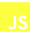
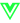

# `I i'm Manjaka Rak? 👋`

## Basically, I love coding, challenges, and learning new things about IT 

___

### for the moment I am very interested in:

~ | ~ | ~
--- | --- | ---
 | JavaScript |     
 | ReactJs |     
 | VueJs |     
 | NodeJs |     
 | MongoDB |     

___

>Je suis toujours prêt pour donner un coup de pouce, partager, et apprendre.
>Vous pouvez me contacter sur d'autre plateforme (mentionnées ci-dessous).
## Contactez-moi
||
--- | --- | ---

  
Petite remarque

  Je suis actuellement à la recherche d'un job en tant que developpeur JavaScript. Si ça vous intérèsse faites-moi signe.

